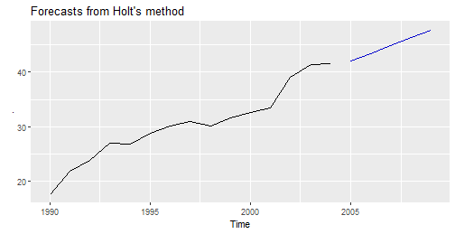
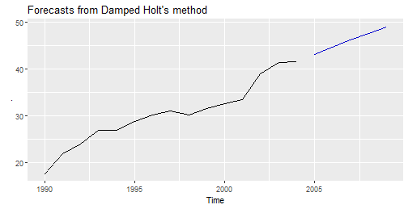
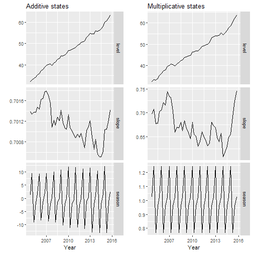

Exponential Smoothing 
========================================================
author: Jeremy O'Brien & Juliann McEachern
date: 17 September 2019
autosize: true
incremental: true
css: template.css 


*Prepared for Data 622 - Predictive Analytics*

Agenda
========================================================
type: sub-section

*  Simple Exponential Smoothing  
*  Trend Methods
*  Seasonal Methods
*  Classification of Methods

***  

*  State Space Models (ETS)
*  ETS Estimatation & Model Selection
*  Forcasting with ETS 

Simple Exponential Smoothing  
========================================================
type: exclaim 


Simple Methods
========================================================

*  Want something in between that weights most recent data more highly.
*  Simple exponential smoothing uses a weighted moving average with weights that decrease exponentially.

========================================================

Time series:  $y_1,y_2,\dots,y_T$.

Random walk forecast:
$$
\begin{aligned}
  \hat{y}{T+h}{T} = y_T$
\end{aligned}
$$

Average forecast:
$$
\begin{aligned}
   \hat{y}{T+h}{T} = \frac1T\sum_{t=1}^T y_t
\end{aligned}
$$


Forecast equation
========================================================

$$
\begin{aligned}
   \hat{y}{T+1}{T} = \alpha y_T + \alpha(1-\alpha) y_{T-1} + \alpha(1-\alpha)^2 y_{T-2}+ \cdots
\end{aligned}

\\ \text{where} 0 \le \alpha \le1$
$$

Component form
========================================================

Iterate to get exponentially weighted moving average form.

$$
\begin{align*}
   \text{Forecast equation}&&\hat{y}{t+h}{t} &= \ell_{t}\\
   \text{Smoothing equation}&&\ell_{t} &= \alpha y_{t} + (1 - \alpha)\ell_{t-1}
\end{align*}
$$

* $\ell_t$ is the level (or the smoothed value) of the series at time t.
* $\hat{y}{t+1}{t} = \alpha y_t + (1-\alpha) \hat{y}{t}{t-1}$

Weighted average form
========================================================

$$
\begin{align*}
   \displaystyle\hat{y}{T+1}{T}=\sum_{j=0}^{T-1} \alpha(1-\alpha)^j y_{T-j}+(1-\alpha)^T \ell_{0}
\end{align*}
$$


Optimization
========================================================

  * Need to choose value for $\alpha$ and $\ell_0$
  * Similarly to regression --- we choose $\alpha$ and $\ell_0$ by minimising SSE:
$$
\begin{aligned}
    \text{SSE}=\sum_{t=1}^T(y_t - \hat{y}{t}{t-1})^2.
\end{aligned}
$$
  * Unlike regression there is no closed form solution --- use numerical optimization.


Example: Oil production
========================================================


```r
oildata <- window(oil, start=1996)
# Estimate parameters
fc <- ses(oildata, h=5)
autoplot(fc) +
  autolayer(fitted(fc), series="Fitted") +
  ylab("Oil (millions of tonnes)") + xlab("Year")
```

***


Trend Methods
========================================================
type: exclaim 


Holt's linear trend
========================================================

Component form
$$
\begin{align*}
   \text{Forecast }&& \hat{y}{t+h}{t} &= \ell_{t} + hb_{t} \\
   \text{Level }&& \ell_{t} &= \alpha y_{t} + (1 - \alpha)(\ell_{t-1} + b_{t-1})\\
   \text{Trend }&& b_{t} &= \beta^*(\ell_{t} - \ell_{t-1}) + (1 -\beta^*)b_{t-1},
\end{align*}
$$

  * Two smoothing parameters $\alpha$ and $ \beta^*$ ($0\le\alpha,\beta^*\le1$).
  * $ \ell_t$ level: weighted average between $y_t$ and one-step ahead forecast for time $ t$, $ (\ell_{t-1} + b_{t-1}=\hat{y}{t}{t-1})$
  * $ b_t$ slope: weighted average of $ (\ell_{t} - \ell_{t-1})$ and $ b_{t-1}$, current and previous estimate of slope.
  * Choose $ \alpha, \beta^*, \ell_0, b_0$ to minimise SSE.


Holt's method in R
========================================================


```r
window(ausair, start=1990, end=2004) %>%
  holt(h=5, PI=FALSE) %>%
  autoplot()
```




Damped trend method
========================================================

Component form
$$
\begin{align*}
  \hat{y}{t+h}{t} &= \ell_{t} + (\phi+\phi^2 + \dots + \phi^{h})b_{t} \\
   \ell_{t} &= \alpha y_{t} + (1 - \alpha)(\ell_{t-1} + \phi b_{t-1})\\
   b_{t} &= \beta^*(\ell_{t} - \ell_{t-1}) + (1 -\beta^*)\phi b_{t-1}.
\end{align*}
$$

  * Damping parameter $0<\phi<1$.
  * If $ \phi=1$, identical to Holt's linear trend.
  * As $ h\rightarrow\infty$, $ \hat{y}{T+h}{T}\rightarrow \ell_T+\phi b_T/(1-\phi)$.
  * Short-run forecasts trended, long-run forecasts constant.


Example: Air passengers
========================================================


```r
window(ausair, start=1990, end=2004) %>%
  holt(damped=TRUE, h=5, PI=FALSE) %>%
  autoplot()
```




Seasonal Methods
========================================================
type: exclaim 


Holt-Winters additive method
========================================================

Holt and Winters extended Holt's method to capture seasonality.

Component form
$$
\begin{align*}
   \hat{y}{t+h}{t} &= \ell_{t} + hb _{t} + s_{t+h-m(k+1)} \\
   \ell_{t} &= \alpha(y_{t} - s_{t-m}) + (1 - \alpha)(\ell_{t-1} + b_{t-1})\\
   b_{t} &= \beta^*(\ell_{t} - \ell_{t-1}) + (1 - \beta^*)b_{t-1}\\
   s_{t} &= \gamma (y_{t}-\ell_{t-1}-b_{t-1}) + (1-\gamma)s_{t-m},
\end{align*}
$$

  * $ k=$ integer part of $ (h-1)/m$. Ensures estimates from the final year are used for forecasting.
  * Parameters:&nbsp; $ 0\le \alpha\le 1$,&nbsp; $ 0\le \beta^*\le 1$,&nbsp; $ 0\le \gamma\le 1-\alpha$&nbsp;  and $ m=$  period of seasonality (e.g. $ m=4$ for quarterly data).


Holt-Winters additive method
========================================================

  * Seasonal component is usually expressed as
        $ s_{t} = \gamma^* (y_{t}-\ell_{t})+ (1-\gamma^*)s_{t-m}.$
  * Substitute in for $\ell_t$:
        $ s_{t} = \gamma^*(1-\alpha) (y_{t}-\ell_{t-1}-b_{t-1})+ [1-\gamma^*(1-\alpha)]s_{t-m}$
  * We set $ \gamma=\gamma^*(1-\alpha)$.
  * The usual parameter restriction is $0\le\gamma^*\le1$, which translates to $ 0\le\gamma\le(1-\alpha)$.


Holt-Winters multiplicative method
========================================================

For when seasonal variations are changing proportional to the level of the series.

Component form
$$
\begin{align*}
   \hat{y}{t+h}{t} &= (\ell_{t} + hb_{t})s_{t+h-m(k+1)}. \\
   \ell_{t} &= \alpha \frac{y_{t}}{s_{t-m}} + (1 - \alpha)(\ell_{t-1} + b_{t-1})\\
   b_{t} &= \beta^*(\ell_{t}-\ell_{t-1}) + (1 - \beta^*)b_{t-1}        \\
   s_{t} &= \gamma \frac{y_{t}}{(\ell_{t-1} + b_{t-1})} + (1 - \gamma)s_{t-m}
\end{align*}
$$

  * $ k$ is integer part of $ (h-1)/m$.
  * With additive method $ s_t$ is in absolute terms:\newline within each year $ \sum_i s_i \approx 0$.
  * With multiplicative method $ s_t$ is in relative terms:\newline within each year $ \sum_i s_i \approx m$.


Example: Visitor Nights
========================================================


```r
aust <- window(austourists,start=2005)
fit1 <- hw(aust,seasonal="additive")
fit2 <- hw(aust,seasonal="multiplicative")
```


```r
tmp <- cbind(Data=aust,
  "HW additive forecasts" = fit1[["mean"]],
  "HW multiplicative forecasts" = fit2[["mean"]])

autoplot(tmp) + xlab("Year") +
  ylab("International visitor night in Australia (millions)") +
  scale_color_manual(name="",
    values=c('#000000','#1b9e77','#d95f02'),
    breaks=c("Data","HW additive forecasts","HW multiplicative forecasts"))
```


Example: Vistor nights estimated components
========================================================


```r
addstates <- fit1$model$states[,1:3]
multstates <- fit2$model$states[,1:3]
colnames(addstates) <- colnames(multstates) <-
  c("level","slope","season")
p1 <- autoplot(addstates, facets=TRUE) + xlab("Year") +
  ylab("") + ggtitle("Additive states")
p2 <- autoplot(multstates, facets=TRUE) + xlab("Year") +
  ylab("") + ggtitle("Multiplicative states")
gridExtra::grid.arrange(p1,p2,ncol=2)
```




Holt-Winters damped method
========================================================

Often the single most accurate forecasting method for seasonal data:
$$
\begin{align*}
   \hat{y}{t+h}{t} &= [\ell_{t} + (\phi+\phi^2 + \dots + \phi^{h})b_{t}]s_{t+h-m(k+1)} \\
   \ell_{t} &= \alpha(y_{t} / s_{t-m}) + (1 - \alpha)(\ell_{t-1} + \phi b_{t-1})\\
   b_{t} &= \beta^*(\ell_{t} - \ell_{t-1}) + (1 - \beta^*)\phi b_{t-1}       \\
   s_{t} &= \gamma \frac{y_{t}}{(\ell_{t-1} + \phi b_{t-1})} + (1 - \gamma)s_{t-m}
\end{align*}
$$

Classification of Methods
========================================================
type: exclaim 


State Space Models (ETS)
========================================================
type: exclaim 


ETS Estimatation & Model Selection
========================================================
type: exclaim 


Forcasting with ETS 
========================================================
type: exclaim 


